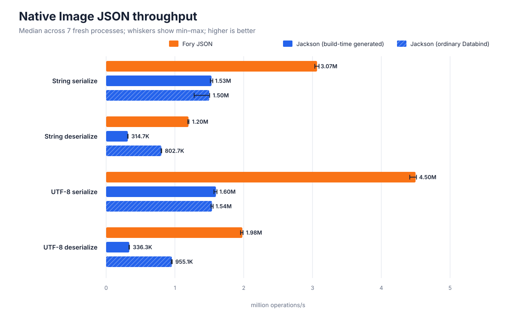
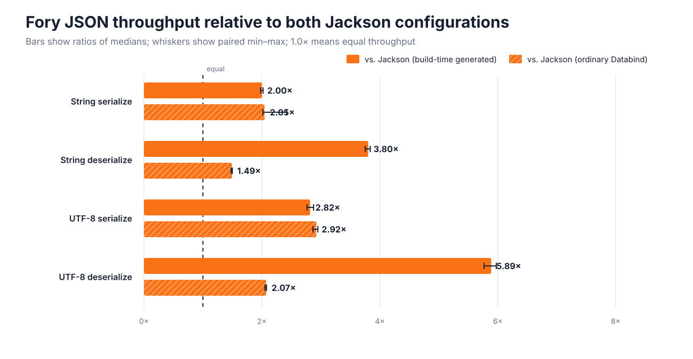

# GraalVM Native Image JSON performance: Fory JSON vs. ordinary and build-time-generated Jackson

## Technical summary

Fory JSON had higher median throughput than build-time-generated Jackson in every operation (2.00×–5.89×). Fory JSON had higher median throughput than ordinary Jackson Databind in every operation (1.49×–2.92×). Build-time-generated Jackson ranged from 0.35× to 1.04× ordinary Jackson Databind.

Each headline is the median from 7 fresh native processes after a 3-second warmup and a 5-second measurement window. All 3 configurations processed the same 256 rotating object graphs and emitted identical JSON bytes (average payload 343.4 bytes). The largest sample coefficient of variation was 5.64%.

This is a direct JSON codec comparison, not an HTTP benchmark. The Jackson cases are reported separately: ordinary Databind with Native Image reflection metadata, and the serializer/deserializer classes generated by Quarkus at build time.

## Median native throughput

Longer bars are faster. Bars show median completed operations per second, and whiskers show the full min–max spread across independent native processes.



| Operation | Fory JSON | Jackson generated | Jackson ordinary | Fory / generated | Fory / ordinary | Generated / ordinary |
| --- | ---: | ---: | ---: | ---: | ---: | ---: |
| String serialize | 3.07M ops/s | 1.53M ops/s | 1.50M ops/s | 2.00× | 2.05× | 1.02× |
| String deserialize | 1.20M ops/s | 314.7K ops/s | 802.7K ops/s | 3.80× | 1.49× | 0.39× |
| UTF-8 serialize | 4.50M ops/s | 1.60M ops/s | 1.54M ops/s | 2.82× | 2.92× | 1.04× |
| UTF-8 deserialize | 1.98M ops/s | 336.3K ops/s | 955.1K ops/s | 5.89× | 2.07× | 0.35× |

| Operation | Fory JSON min–max (CV) | Jackson (build-time generated) min–max (CV) | Jackson (ordinary Databind) min–max (CV) |
| --- | ---: | ---: | ---: |
| String serialize | 3.03M–3.10M (0.70% CV) | 1.52M–1.55M (0.83% CV) | 1.28M–1.50M (5.64% CV) |
| String deserialize | 1.19M–1.20M (0.55% CV) | 312.8K–318.6K (0.74% CV) | 799.4K–807.7K (0.38% CV) |
| UTF-8 serialize | 4.41M–4.51M (0.79% CV) | 1.57M–1.61M (0.85% CV) | 1.53M–1.56M (0.62% CV) |
| UTF-8 deserialize | 1.95M–1.99M (0.74% CV) | 331.9K–339.0K (0.65% CV) | 947.2K–960.5K (0.51% CV) |

## Relative throughput

Each bar divides Fory JSON's median throughput by the named Jackson baseline. The whiskers and table pair samples with the same fork number to expose the full paired ratio range; 1.0× means equal throughput.



| Operation | Baseline | Ratio of medians | Median paired ratio | Paired min–max |
| --- | --- | ---: | ---: | ---: |
| String serialize | Jackson (build-time generated) | 2.00× | 1.99× | 1.98×–2.02× |
| String serialize | Jackson (ordinary Databind) | 2.05× | 2.05× | 2.02×–2.42× |
| String deserialize | Jackson (build-time generated) | 3.80× | 3.79× | 3.75×–3.84× |
| String deserialize | Jackson (ordinary Databind) | 1.49× | 1.49× | 1.48×–1.50× |
| UTF-8 serialize | Jackson (build-time generated) | 2.82× | 2.83× | 2.76×–2.88× |
| UTF-8 serialize | Jackson (ordinary Databind) | 2.92× | 2.91× | 2.86×–2.95× |
| UTF-8 deserialize | Jackson (build-time generated) | 5.89× | 5.89× | 5.77×–5.97× |
| UTF-8 deserialize | Jackson (ordinary Databind) | 2.07× | 2.07× | 2.05×–2.08× |

## What was measured

The payload follows the `Customer` shape from the [Quarkus metaprogramming article](https://quarkus.io/blog/quarkus-metaprogramming/): inherited person fields, an address, two children, two credit cards, and income. The harness rotates through 256 deterministic variations.

- **String serialize:** Java object to a newly allocated JSON `String`.
- **String deserialize:** JSON `String` to a new `Customer` graph.
- **UTF-8 serialize:** Java object to a newly allocated UTF-8 `byte[]`.
- **UTF-8 deserialize:** UTF-8 `byte[]` to a new `Customer` graph.

Throughput is completed operations divided by measured nanoseconds inside each native process. Serialization consumes output length and a byte or character; deserialization computes a fingerprint over the decoded graph. The same checksum paths prevent dead-code elimination in every configuration.

## Build-time integration and benchmark method

Fory JSON 1.6.0 and both Jackson configurations using Jackson Databind 2.22.0 were compiled into separate native executables with the same GraalVM toolchain, `-O3`, and fallback disabled. Separate images keep each configuration's code and metadata isolated.

Fory registers mapping mix-ins and exposes its field-based configuration through a reachable `@ForyJsonProvider`, allowing its Native Image feature to generate object codecs at image build time. The single-threaded configuration uses a concurrency level of one and disables asynchronous compilation.

Ordinary Jackson uses a field-only `ObjectMapper`, explicit property-order mix-ins, and Native Image reflection metadata for the four model classes.

The generated case uses Quarkus 3.37.4 and its current [reflection-free Jackson integration](https://quarkus.io/guides/rest#reflection-free-jackson-serialization-and-deserialization). A REST resource exposes `Customer` as both a response and request type so Quarkus discovers the model during augmentation. The timed path then calls the injected `ObjectMapper` directly; it does not send HTTP requests.

Native verification proved that Jackson selected `org.apache.fory.benchmark.model.Customer$quarkusjacksonserializer` for serialization and `org.apache.fory.benchmark.model.Customer$quarkusjacksondeserializer` for deserialization. These are Quarkus-generated implementations, not handwritten benchmark serializers.

For each operation, the runner launched 7 fresh native processes and rotated all configurations through deterministic process-order permutations. Each process initialized its mapper, prepared and verified fixtures, and—where applicable—started Quarkus before the timed region. It then used a 3-second warmup and a 5-second measurement window in batches of 64. JVM tests check all 256 round trips and exact String and UTF-8 output equality. Native verification requires the same serialized-payload hash from every executable before timing begins.

## Executable size and peak process memory

Executable size is the final file size. Peak resident set size (RSS) is the operating system's high-water mark for each complete process, including initialization, fixture preparation, and measurement; it is not an allocation-rate measurement.

| Configuration | Native executable |
| --- | ---: |
| Fory JSON | 30.7 MiB |
| Jackson (build-time generated) | 76.0 MiB |
| Jackson (ordinary Databind) | 23.2 MiB |

| Operation | Fory JSON median peak RSS | Jackson (build-time generated) median peak RSS | Jackson (ordinary Databind) median peak RSS |
| --- | ---: | ---: | ---: |
| String serialize | 61.4 MiB | 76.2 MiB | 64.3 MiB |
| String deserialize | 61.4 MiB | 76.5 MiB | 64.5 MiB |
| UTF-8 serialize | 61.3 MiB | 76.2 MiB | 64.3 MiB |
| UTF-8 deserialize | 61.4 MiB | 76.5 MiB | 64.3 MiB |

The generated Jackson executable and its whole-process RSS include the Quarkus runtime. Those two deployment-container measurements are therefore not codec-only size or memory comparisons with the standalone executables.

## Test environment

| Item | Value |
| --- | --- |
| CPU | Apple M4 Pro (12 logical CPUs) |
| Memory | 48.0 GiB |
| OS | macOS-15.7.2-arm64-arm-64bit |
| Native Image | native-image 25.0.1 2025-10-21 |
| Maven | Apache Maven 3.9.16 (2bdd9fddda4b155ebf8000e807eb73fd829a51d5) |
| Fory JSON | 1.6.0 |
| Jackson Databind | 2.22.0 |
| Quarkus | 3.37.4 |
| Repository commit | `97ac691f944a8aea22dc5ea70aa9058af339dc0f` |

## Limits and robustness

- These results describe one model, payload size, machine, Native Image version, and configuration. They do not establish a universal multiplier.
- The harness measures single-threaded, steady-state codec throughput after warmup. It does not measure cold startup, first-request latency, HTTP routing, sockets, concurrent requests, garbage-collection pauses, or allocation rate.
- The generated Jackson timing includes direct codec calls only; its binary size and RSS include the surrounding Quarkus runtime.
- Min–max ranges, sample standard deviation, paired ratios, commands, stdout, stderr, and peak RSS readings are retained in the saved artifacts.

## Recommended next steps

1. Repeat the committed harness on the deployment CPU and GraalVM release used in production.
2. Add representative application models and payload distributions before choosing a framework.
3. Use an end-to-end service benchmark when the decision depends on request throughput rather than JSON codec cost alone.

## Reproduce the run

Build and verify all native executables:

```bash
GRAALVM_HOME=/path/to/graalvm ./scripts/build_native.sh
```

Run the full default benchmark:

```bash
python3 scripts/run_benchmarks.py --output results/my-run
```

Regenerate this report from saved raw records:

```bash
python3 scripts/render_report.py results/my-run
```

The saved evidence is in [`raw.jsonl`](raw.jsonl), [`summary.csv`](summary.csv), [`summary.json`](summary.json), [`environment.json`](environment.json), and [`report-notes.json`](report-notes.json).
