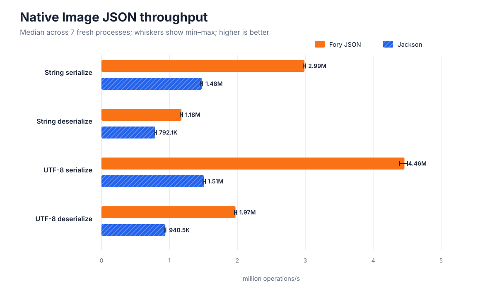
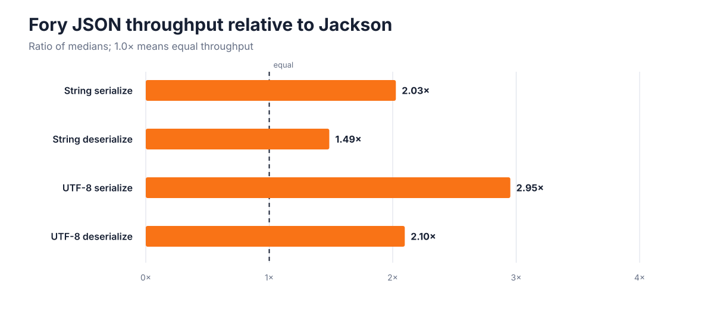

# GraalVM Native Image JSON performance: Fory JSON vs. Jackson

## Technical summary

On this machine and benchmark harness, Fory JSON recorded higher median throughput in all 4 operations, from 1.49× to 2.95× Jackson. The strongest relative result was UTF-8 serialize at 2.95×; the narrowest was String deserialize at 1.49×.

Each headline is the median of 7 fresh native processes after a 3-second warmup and a 5-second measurement window. Both libraries processed the same 256 rotating object graphs and emitted identical JSON bytes (average payload 343.4 bytes). The largest sample coefficient of variation was 0.92%.

This is a codec-layer comparison. Jackson uses conventional Databind with explicit Native Image reflection metadata; it does **not** use the experimental reflection-free Jackson serializer generator described in the Quarkus metaprogramming article.

## Fory JSON records higher native throughput in all 4 operations

The chart compares completed operations per second; longer bars are faster. Bars show each library's median, while the whiskers expose the full min–max spread across independent process forks. The exact values are in the table immediately below.



| Operation | Fory JSON median | Jackson median | Fory / Jackson | Fory min–max | Jackson min–max |
| --- | ---: | ---: | ---: | ---: | ---: |
| String serialize | 2.99M ops/s | 1.48M ops/s | 2.03× | 2.98M–3.00M | 1.46M–1.49M |
| String deserialize | 1.18M ops/s | 792.1K ops/s | 1.49× | 1.17M–1.20M | 786.1K–808.1K |
| UTF-8 serialize | 4.46M ops/s | 1.51M ops/s | 2.95× | 4.39M–4.51M | 1.50M–1.53M |
| UTF-8 deserialize | 1.97M ops/s | 940.5K ops/s | 2.10× | 1.96M–1.99M | 933.4K–947.3K |

## Fory JSON leads each relative throughput comparison in this run

The relative chart divides the two median throughputs for each operation. As a sensitivity check, the table also pairs Fory and Jackson samples from the same fork and reports the full range of paired ratios.



| Operation | Ratio of medians | Median paired ratio | Paired min–max |
| --- | ---: | ---: | ---: |
| String serialize | 2.03× | 2.03× | 2.01×–2.04× |
| String deserialize | 1.49× | 1.48× | 1.47×–1.50× |
| UTF-8 serialize | 2.95× | 2.97× | 2.89×–3.00× |
| UTF-8 deserialize | 2.10× | 2.10× | 2.08×–2.12× |

## What was measured

The payload follows the `Customer` shape from the [Quarkus metaprogramming article](https://quarkus.io/blog/quarkus-metaprogramming/): inherited person fields, an address, two children, two credit cards, and income. The harness rotates through 256 deterministic variations so one constant object cannot define the entire workload.

- **String serialize:** Java object to a newly allocated JSON `String`.
- **String deserialize:** JSON `String` to a new `Customer` graph.
- **UTF-8 serialize:** Java object to a newly allocated UTF-8 `byte[]`.
- **UTF-8 deserialize:** UTF-8 `byte[]` to a new `Customer` graph.

Throughput is completed operations divided by the measured nanoseconds inside the native process. Serialization consumes output length and a byte or character; deserialization computes a fingerprint over the decoded graph. These checksum paths prevent dead-code elimination and are identical across libraries.

## Build-time integration and benchmark method

Fory JSON 1.6.0 and Jackson Databind 2.22.1 were compiled into separate executables with the same GraalVM Native Image toolchain, `-O3`, and `--no-fallback`. Keeping separate images prevents one library or its metadata from becoming reachable in the other's executable.

Fory registers four mix-ins and exposes the benchmark configuration through a reachable `@ForyJsonProvider`, allowing its Native Image Feature to generate object codecs at image build time. The single-threaded configuration uses field mode with a concurrency level of one and disables asynchronous compilation. Jackson uses a field-only `ObjectMapper`, alphabetic property ordering, and explicit reflection metadata for the same four model classes.

For every operation, the runner launched 7 fresh native processes and alternated which library ran first. Each process prepared and verified its fixtures outside the timed region, used a 3-second warmup, then used a 5-second measurement window in batches of 64. The JVM test suite separately checks all 256 round trips, semantic JSON equality, and exact String and UTF-8 output equality. Before native timing, the runner also requires both native executables to report the same hash over all 256 serialized payloads.

## Executable size and peak process memory

Executable size is the final file size. Peak resident set size (RSS) is the high-water mark reported by the operating-system `time` utility for each complete benchmark process, including fixture preparation and the timed phase; it is not an allocation-rate measurement.

| Library | Native executable |
| --- | ---: |
| Fory JSON | 30.7 MiB |
| Jackson | 23.2 MiB |

| Operation | Fory JSON median peak RSS | Jackson median peak RSS |
| --- | ---: | ---: |
| String serialize | 61.4 MiB | 64.0 MiB |
| String deserialize | 61.5 MiB | 64.2 MiB |
| UTF-8 serialize | 61.3 MiB | 64.0 MiB |
| UTF-8 deserialize | 61.4 MiB | 64.2 MiB |

## Test environment

| Item | Value |
| --- | --- |
| CPU | Apple M4 Pro (12 logical CPUs) |
| Memory | 48.0 GiB |
| OS | macOS-15.7.2-arm64-arm-64bit |
| Native Image | native-image 25.0.1 2025-10-21 |
| Fory JSON | 1.6.0 |
| Jackson Databind | 2.22.1 |
| Repository commit | `d7b6d60b9ae36fdf52a31fe954e88d71141f68cc` |

## Limits and robustness

- These results describe one model, payload size, machine, Native Image version, and library configuration. They do not establish a universal multiplier.
- The harness measures steady-state codec throughput after warmup. It does not measure cold startup, first-request latency, HTTP routing, sockets, concurrency, garbage-collection pauses, or allocation rate.
- The Jackson baseline is conventional Databind under Native Image. Comparing Fory against Quarkus's generated Jackson serializers would require a different adapter and is outside this run.
- Min–max ranges, sample standard deviation, paired ratios, every command, stdout, stderr, and peak RSS reading are retained in the saved artifacts so variation is auditable.

## Recommended next steps

1. Repeat the same committed harness on the deployment CPU and GraalVM release used in production.
2. Add representative application models and payload distributions before making a framework decision.
3. Use an end-to-end service benchmark if the decision depends on request throughput rather than JSON codec cost alone.

## Further questions

- How do the relative results change with larger payloads, escaped Unicode, null-heavy objects, or deeply nested collections?
- What do allocation profiles and latency percentiles show for each operation?
- How do profile-guided Native Image builds and Quarkus-generated Jackson serializers change the comparison?

## Reproduce the run

Build and verify both native executables:

```bash
GRAALVM_HOME=/path/to/graalvm ./scripts/build_native.sh
```

Run the full default benchmark:

```bash
python3 scripts/run_benchmarks.py --output results/my-run
```

Regenerate this report from saved raw records:

```bash
python3 scripts/render_report.py results/my-run
```

The saved evidence is in [`raw.jsonl`](raw.jsonl), [`summary.csv`](summary.csv), [`summary.json`](summary.json), [`environment.json`](environment.json), and [`report-notes.json`](report-notes.json).
